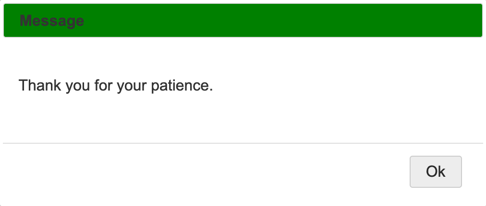
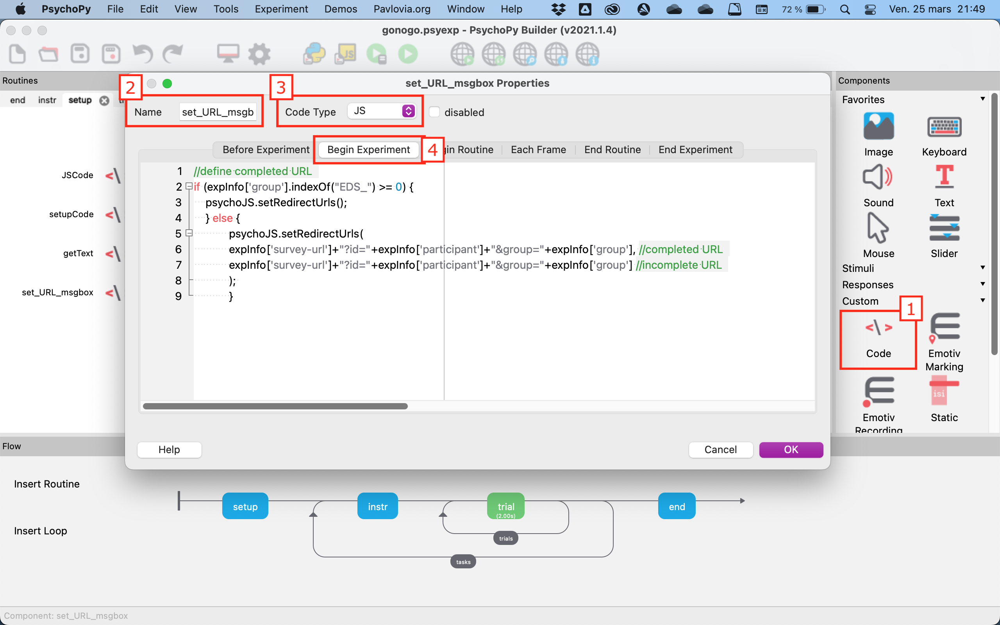
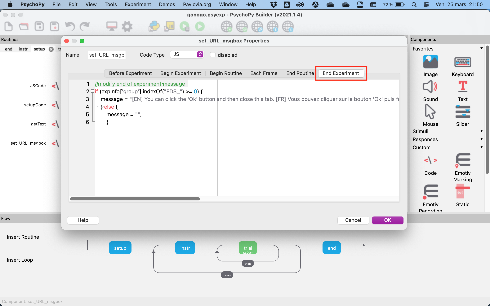
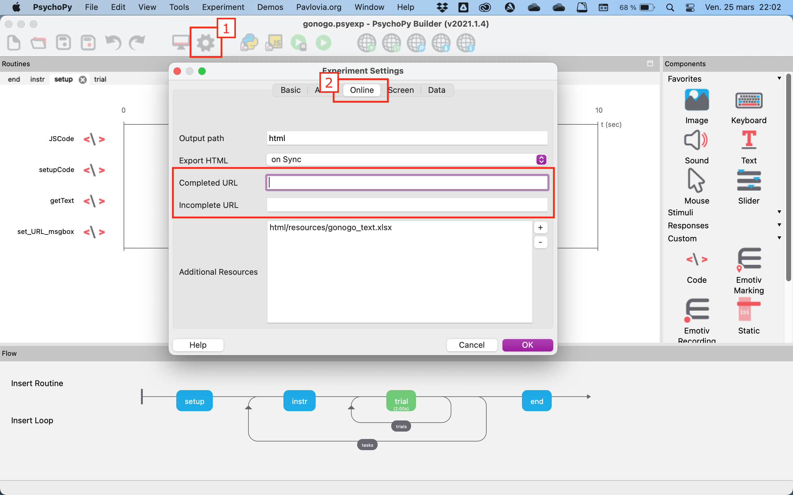

# How to have different completion URLs and End of Experiment message box a PsychoPy task

This documentation explains how to add multiple completion URLs and have different "End of Experiment" messages to an existing PsychoPy task.

- The "End of Experiment" message box shows a message to participants when they finish the task (see below).



- A completion URL automatically redirects participants to another webpage after the "End of Experiment" message box has been displayed.

In this example, we don't want participants in the **EDS_sober** and **EDS_high** groups to be redirected anywhere while all other participants will be redirected to a Qualtrics survey. We also want to show different "End of Experiment" messages to them.

## 1. Insert a new code component

- Go to the very beginning of the experiment (**setup** routine)
- Insert a code component named `set_URL_msgbox`
- Set **Code Type** to `JS` (JavaScript)
- Go to the **Begin Experiment** tab



- Copy and paste the following code:

```js
//define completed URL
if (expInfo['group'].indexOf("EDS_") >= 0) {
    psychoJS.setRedirectUrls();
    } else {
            psychoJS.setRedirectUrls(
            expInfo['survey-url']+"?id="+expInfo['participant']+"&group="+expInfo['group'], //completed URL
            expInfo['survey-url']+"?id="+expInfo['participant']+"&group="+expInfo['group'] //incomplete URL
            );
            }
```

- Go to the **End Experiment** tab



- Copy and paste the following code:

```js
//modify end of experiment message
if (expInfo['group'].indexOf("EDS_") >= 0) {
    message = "[EN] You can click the 'Ok' button and then close this tab. [FR] Vous pouvez cliquer sur le bouton 'Ok' puis fermer cet onglet.";
    } else {
        message = "";
        }
```

## 2. Remove existing redirecting URLs

- Access the *Experiment Settings* by clicking on the gear wheel icon
- Go to the **Online** tab
- If there is something written inside the `Completed URL` and `Incomplete URL` fields, delete it


