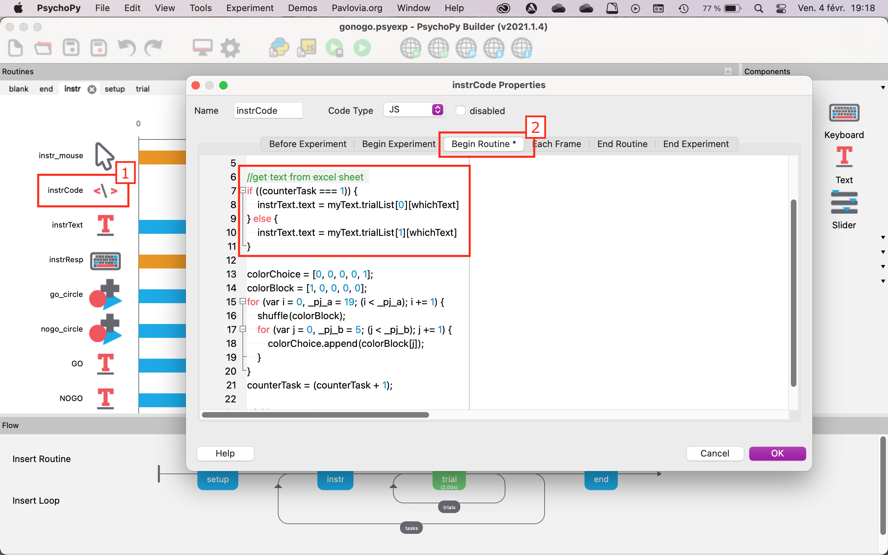

# How to add multilanguage instructions to a PsychoPy task

This documentation explains how to add multilanguage instructions to an existing PsychoPy task.

In this example, we want to have 4 different sets of instructions depending on:
- the device used
  - with touchscreen
  - without touchscreen
- the preferred language
  - English
  - French

---

## Create an Excel spreadsheet

The sets of instructions are stored in a spreadsheet so it is easier to reference them in PsychoPy later.

The Excel spreadsheet should have **only 1** tab (everything outside the 1st tab won't be read).

- Prepare the headers
  - On the first row: enter a code for the device and the language used (e.g., EN_touchscreen for English and touchscreen device).
  - On the first column: enter the type of message used in the experiment (e.g., welcome, instructions, feedback, thank you messages). I recommend adding a number to keep track of the rows but **start at 0** because JavaScript indexes are zero-based (they start at 0 instead 1).
- Write the instructions in the corresponding cells
- Save the document as **.xlsx**
- Make sure to put the Excel document in the same directory as the **.psyexp** file of the PsychoPy experiment


---

## Modify the PsychoPy experiment

### 1. Change the *Experiment Settings*

*Experiment Settings* are accessible by clicking on the gear wheel icon.


#### Tab *Basic*

Add `language` and `touchscreen` fields to the **Experiment info** (you can assign a default value to those fields with you want).

In this example:
- `touchscreen` = 0 for devices without touchscreen
- `touchscreen` = 1 for devices with touchscreen
- `language` = EN for English
- `language` = FR for French


#### Tab *Online*

Add the Excel document as an additional resource.


### 2. Change the code inside the experiment

#### 2.1. Insert a new code component

- Insert a code component named `getText` to extract and store a list of messages from the Excel document
- Go to the **Begin Experiment** tab
- Set **Code Type** to `JS` (JavaScript)


- Copy and paste the following code:

```
textFile = "gonogo_text.xlsx"

myText = new TrialHandler({
  psychoJS: psychoJS,
  nReps: 1, method: TrialHandler.Method.SEQUENTIAL,
  extraInfo: expInfo, originPath: undefined,
  trialList: textFile,
  seed: undefined, name: 'myText'});

  if ((expInfo["touchscreen"] === "0")) {
    whichText = (expInfo["language"].toString() + "_notouchscreen");
    } else {
      whichText = (expInfo["language"].toString() + "_touchscreen");
    }
```

Let's break down these 3 chunks of code:
1. Sets `textFile` value to the name of the Excel document (`"gonogo_text.xlsx"` in this case)
2. Creates a `myText.trialList` structure that stores the text messages from the `textFile`
3. Defines the string `whichText` which concatenates the language and the device fields from the **Experiment settings**.
<span style="color:red">/!\ </span> `whichText` *has to be exactly the same as the column headers in the Excel document*

<br>

#### 2.2. Understand the structure of `myText.trialList`

All the text messages have been extracted into  `myText.trialList` and now we have to tell PsychoPy which message to access through indexing.

- `whichText` will automatically refer to the appropriate column, using the information from the **Experiment settings**
- the numeric index (starting at 0) will refer to the appropriate row

In this example:
- `myText.trialList[0][whichText]` = instructions for the 1st block of trials
-  `myText.trialList[1][whichText]` = instructions for the subsequent blocks of trials
-  `myText.trialList[2][whichText]` = end message of the experiment


<br>

#### 2.3. Change all the text components in the experiment

Find every single text component that you need to translate. They can be inside pre-existing code elements or inside text elements.

##### 1. Inside code elements

Here, the instructions are set through a code component because we want the instructions for the 1st block to be slightly different from those in the subsequent blocks.
- click on the code element (here `instrCode`)
- find where the text is defined, most of the time it's in the **Begin Routine** or the **Each Frame** tabs
- look for something that looks like `<name_of_variable>.text =` and replace what is after "=" by `myText.trialList[i][whichText]`; *i being a numeric index*



In this example, `instrText.text = myText.trialList[0][whichText]` for the 1st block and `instrText.text = myText.trialList[1][whichText]` for the subsequent blocks.

##### 2. Inside text elements

If the text is defined directly using the text component.
- click on the text component (here `endText`)
- in the **Basic** tab, delete what's inside the text box and replace with `$myText.trialList[i][whichText]`; *i being a numeric index.* <span style="color:red">/!\ </span> *Don't forget the `$` at the beginning, it tells Psychopy it is code and not just regular text*
- make sure the right dropdown menu is set to **constant**


<br>

#### 2.3. Save the modifications

- Save your project: **File > Save**
- Export into HTLM to update .js and .html files: **File > Export HTML**


---

## Run the experiment

When running the experiment, fill in the **touchscreen** and **language** fields to get the corresponding instructions.

For English without touchscreen:

 

For French with touchscreen:

 
